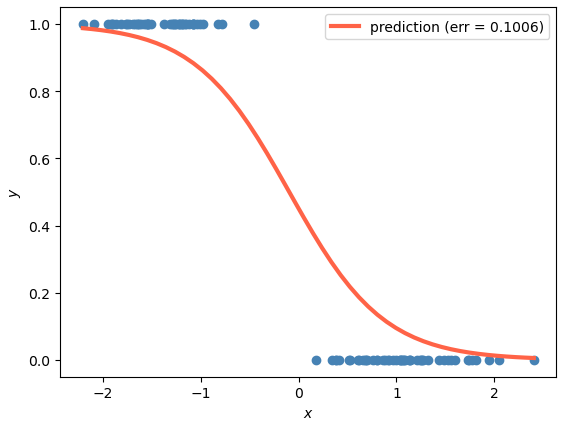

## Deep Learning and Neural Nets I

5 exercise projects to learn basics of Deep Learning and follow the lectures of Deep Learning and Neural Nets I.

- Linear, Logistic, Softmax regression
- One-hot encoding
- Gradient Descend
- Activation Function Module, RELU, ELU ...
- Multi layer perceptron
- CNNs
- Spatial Reduction, Pooling
- Adaptive Opimisation
- Network Training
- Regularization, Initialization and Normalization

